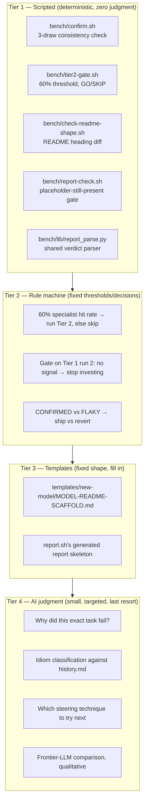
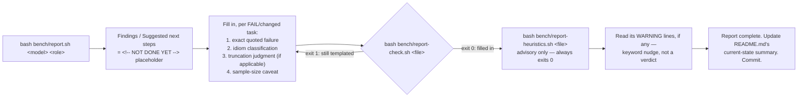

# Quality loop workflow — visual guide + AI quick-reference

`AGENTS.md` is the authoritative rule text — if this doc and `AGENTS.md`
ever disagree, `AGENTS.md` wins and this doc is stale. This file exists
as a visual companion for humans, and as a fast orientation aid for an
AI agent picking up a quality-loop task cold: read the diagrams and the
"Quick reference for an agent" table below before re-reading all of
`AGENTS.md` line by line.

## The control mechanism: scripted first, AI judgment last

This project's tooling is deliberately layered so that as little as
possible depends on an agent remembering a rule correctly. Each tier
below exists to shrink what the tier after it has to do:

**Why this order:** a script can't misremember a threshold or forget to
run a check. A rule machine can't be talked out of a decision. A
template can't drift into narrative. Only genuine diagnosis — reading a
raw failure and explaining *why* — actually needs a model's judgment,
so that's the only tier that costs real tokens and real risk of error.

## The loop, end to end

```mermaid
flowchart TD
    Start(["Request: test+optimize model for role"]) --> Prior{"Prior reports/README/<br/>history.md exist?"}
    Prior -- yes --> Resume["Map prior runs onto the phases below.<br/>Continue from there — don't restart at Phase 1."]
    Prior -- no --> P0
    Resume --> P0

    P0["Phase 0 — Pre-flight infra research<br/>(conditional: new model, or truncation/<br/>empty output/runaway generation seen)"] --> P1

    P1["Phase 1 — Reference run<br/>bash bench/report.sh &lt;model&gt; &lt;role&gt;<br/>anchor for every later comparison"] --> RES

    RES["Research phase — always both, uncapped<br/>1. cross-model idiom check (other models' history.md)<br/>2. external research (web, model card)"] --> T1

    T1["Tier 1 — per-task specialist steering<br/>≤4 runs/task · gate on run 2: no signal → stop<br/>writes models/&lt;model&gt;/task-overrides/&lt;task&gt;.md"] --> GATE

    GATE{"bash bench/tier2-gate.sh &lt;report&gt;<br/>≥60% specialist hit rate?"}
    GATE -- "exit 0 — GO" --> T2["Tier 2 — generalist search<br/>≤5 runs · one shared config attempt<br/>'no generalist exists' is a valid outcome"]
    GATE -- "exit 1 — SKIP" --> CONFIRM

    T2 --> CONFIRM["Confirm<br/>bash bench/confirm.sh &lt;model&gt; &lt;role&gt;<br/>3 more back-to-back runs, unchanged state"]

    CONFIRM --> V{"CONFIRMED or FLAKY?"}
    V -- FLAKY --> REVERT["Revert to last committed checkpoint"] --> CONFIRM
    V -- CONFIRMED --> PERF

    PERF["Performance run — ≤5 runs<br/>token/latency only, quality must not regress<br/>(re-check verdicts after every change)"] --> FINAL

    FINAL["Final report — replaces README.md's<br/>per-role section (not a separate doc)"] --> SHAPE

    SHAPE{"bash bench/check-readme-shape.sh &lt;model&gt;"}
    SHAPE -- "exit 1 — headings missing" --> FINAL
    SHAPE -- "exit 0 — OK" --> DONE(["Commit + push. Done."])
```

One full pass for "test and optimize `<model>` for `<role>`":

Phase/tier transitions are autonomous — state what finished and its
result, then proceed. Don't stop to ask between phases; only stop when
a finding genuinely changes strategy in a way `AGENTS.md`'s rules don't
already resolve.

## Completing a single report (the sub-loop inside Phase 1/Tier 1/Tier 2)

Every `report.sh` call needs this close-out before the run counts as
done — this is the mechanism the diagram above assumes happens after
every box that mentions `report.sh`:

## Quick reference for an agent

Consult this table before re-deriving a decision from prose — it's the
same rule, just indexed by "what am I looking at right now."

| Situation | Run this | Read the result as | Full rule in `AGENTS.md` |
|---|---|---|---|
| Starting a model+role loop | Read `models/<model>/reports/report-<role>-*.md`, `README.md`, `history.md` | Map onto phases below, don't restart at Phase 1 | "The quality loop" |
| `report.sh` just ran | `bash bench/report-check.sh <file>` | exit 0 = done, exit 1 = still templated, go fill in Findings/Suggested-next-steps | "Completing a report" |
| Report is filled in | `bash bench/report-heuristics.sh <file>` | always exit 0; WARNING lines are a nudge to re-read, not a fail | "Completing a report" |
| Tier 1 has settled (every task specialist-fixed or gated out) | `bash bench/tier2-gate.sh <report-file>` | exit 0 = GO, run Tier 2; exit 1 = SKIP, go straight to Confirm | "The quality loop", Tier 2 gate |
| Improvement has plateaued | `bash bench/confirm.sh <model> <role>` | writes CONFIRMED (ship it) or FLAKY (revert, re-confirm) | "Confirm" |
| About to call the Final report done | `bash bench/check-readme-shape.sh <model>` | exit 0 = headings match scaffold, exit 1 = lists what's missing | "Final report" |
| Any dispatch-level tweak used (env var, `-ngl`, `--reasoning-budget`, ...) | — | must be written into `models/<model>/README.md`'s Setup section before the run counts as reported | "Every dispatch-level tweak must be documented" |

## See also

- [`../AGENTS.md`](../AGENTS.md) — authoritative rule text this doc visualizes.
- [`../history.md`](../history.md) — why several of these gates exist (each was added after a real, caught mistake).
- `GRAMMAR-STEERING-PATTERNS.md` — the Tier 2 "no generalist config, check for a generalist decision procedure" case in more depth.
