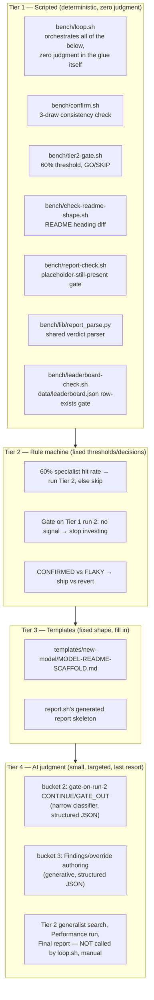
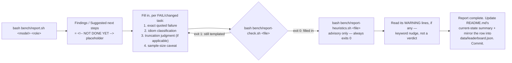

# Quality loop workflow — visual guide + AI quick-reference

`AGENTS.md` is the authoritative rule text — if this doc and `AGENTS.md`
ever disagree, `AGENTS.md` wins and this doc is stale. This file exists
as a visual companion for humans, and as a fast orientation aid for an
AI agent picking up a quality-loop task cold: read the diagrams and the
"Quick reference for an agent" table below before re-reading all of
`AGENTS.md` line by line.

**`bash bench/loop.sh <model> <role>` is the thing to run.** It's the
scripted orchestrator for everything from Phase 1 through Confirm —
the diagrams below are what it implements, not a manual alternative to
it. It stops cleanly after Confirm; Tier 2's generalist search, the
Performance run, and the Final report stay manual/Claude-Code-driven.

## The control mechanism: scripted first, AI judgment last

This project's tooling is deliberately layered so that as little as
possible depends on an agent remembering a rule correctly. Each tier
below exists to shrink what the tier after it has to do — and
`bench/loop.sh` is the piece that actually walks a run down through the
tiers, only reaching into Tier 4 at two narrow, well-defined points:

**Why this order:** a script can't misremember a threshold or forget to
run a check. A rule machine can't be talked out of a decision. A
template can't drift into narrative. Only genuine diagnosis — reading a
raw failure and explaining *why* — actually needs a model's judgment,
so that's the only tier that costs real tokens and real risk of error.
`loop.sh`'s two call-outs (bucket 2, bucket 3) are both stateless and
tool-free (`--tools ""` — the script does all file I/O itself) and
structured (`--json-schema` — a guaranteed field to extract, not
text-boundary parsing).

## The loop, end to end

One full pass for "test and optimize `<model>` for `<role>`":

Green = `loop.sh` runs this automatically. Orange = still manual —
either it needs real tool use `loop.sh` deliberately doesn't have
(web search, for external research), or it's a holistic/qualitative
step (Tier 2 search, Performance, Final report) kept out of the
scripted path on purpose.

```mermaid
flowchart TD
    Start(["Request: test+optimize model for role"]) --> Prior{"Prior report exists?"}
    Prior -- yes --> Resume["Resume from latest report"]
    Prior -- no --> P0
    Resume --> P1

    P0["Phase 0 — Pre-flight infra research<br/>(conditional)"] --> P1

    P1["Phase 1 — Reference run<br/>bash bench/report.sh &lt;model&gt; &lt;role&gt;"] --> RES1

    RES1["Research phase — cross-model idiom check<br/>map-reduce: 1 call/other-model + 1 combine call<br/>writes models/&lt;model&gt;/research-&lt;role&gt;.md<br/>skipped if that file already exists"] --> RES2

    RES2["Research phase — external research<br/>web search, model card lookup"] --> T1

    T1["Tier 1 — per-task specialist steering<br/>≤4 runs/task · gate on run 2 once<br/>writes models/&lt;model&gt;/task-overrides/&lt;task&gt;.md<br/>(reads research-&lt;role&gt;.md above as candidate<br/>techniques, plus same-model history.md)"] --> GATE

    GATE{"bash bench/tier2-gate.sh &lt;report&gt;<br/>≥60% specialist hit rate?"}
    GATE -- "exit 0 — GO" --> T2["Tier 2 — generalist search<br/>≤5 runs · one shared config attempt"]
    GATE -- "exit 1 — SKIP" --> CONFIRM

    T2 --> CONFIRM["Confirm<br/>bash bench/confirm.sh &lt;model&gt; &lt;role&gt;"]

    CONFIRM --> V{"CONFIRMED or FLAKY?"}
    V -- FLAKY --> REVERT["Revert to last committed checkpoint"] --> CONFIRM
    V -- CONFIRMED --> PERF

    PERF["Performance run — ≤5 runs"] --> FINAL
    FINAL["Final report — replaces README.md's<br/>per-role section"] --> SHAPE
    SHAPE{"bash bench/check-readme-shape.sh &lt;model&gt;"}
    SHAPE -- "exit 1" --> FINAL
    SHAPE -- "exit 0" --> LB
    LB{"bash bench/leaderboard-check.sh &lt;model&gt;"}
    LB -- "exit 1" --> FINAL
    LB -- "exit 0" --> DONE(["Commit + push. Done."])

    classDef auto fill:#1a5c2e,stroke:#2ecc71,color:#fff
    classDef manual fill:#7a3b0e,stroke:#e67e22,color:#fff
    class Start,Prior,Resume,P1,RES1,T1,GATE,CONFIRM,V auto
    class P0,RES2,T2,REVERT,PERF,FINAL,SHAPE,LB,DONE manual
```

`bench/loop.sh` stops right after Confirm and prints what's left
manual, every run — it never silently claims to have done Phase 0,
the full Research phase, Tier 2, Performance, or the Final report.

Phase/tier transitions are autonomous — state what finished and its
result, then proceed. Don't stop to ask between phases; only stop when
a finding genuinely changes strategy in a way `AGENTS.md`'s rules don't
already resolve.

## Completing a single report (the sub-loop inside Phase 1/Tier 1/Tier 2)

Every `report.sh` call needs this close-out before the run counts as
done — this is the mechanism the diagram above assumes happens after
every box that mentions `report.sh`. **`bench/loop.sh` runs this whole
sub-loop automatically** (its `complete_report_findings` function is
the FILL step below — a structured `claude -p` call, not manual
writing) — shown here for what it's actually doing, and for anyone
completing a report outside `loop.sh` (e.g. Tier 2/Performance/Final
report runs, which stay manual):

## Quick reference for an agent

Consult this table before re-deriving a decision from prose — it's the
same rule, just indexed by "what am I looking at right now."

| Situation | Run this | Read the result as | Full rule in `AGENTS.md` |
|---|---|---|---|
| **Starting a model+role loop** | `bash bench/loop.sh <model> <role>` | Runs Phase 1 → Tier 1 → gate → Confirm unattended; prints what's still manual when it stops | "The quality loop" |
| Debugging a `loop.sh` run that did something wrong | `bash bench/loop.sh --verbose ...`, then read `bench/logs/loop.sh-<timestamp>-<pid>.log` | Full command trace (bash's own `set -x`) plus every sub-script's output — every `bench/*.sh` script writes its own timestamped log the same way | (script header comments) |
| `report.sh` just ran, outside `loop.sh` | `bash bench/report-check.sh <file>` | exit 0 = done, exit 1 = still templated, go fill in Findings/Suggested-next-steps | "Completing a report" |
| Report is filled in | `bash bench/report-heuristics.sh <file>` | always exit 0; WARNING lines are a nudge to re-read, not a fail | "Completing a report" |
| Tier 1 has settled (every task specialist-fixed or gated out) | `bash bench/tier2-gate.sh <report-file>` | exit 0 = GO, run Tier 2; exit 1 = SKIP, go straight to Confirm | "The quality loop", Tier 2 gate |
| Improvement has plateaued, outside `loop.sh` | `bash bench/confirm.sh <model> <role>` | writes CONFIRMED (ship it) or FLAKY (revert, re-confirm) | "Confirm" |
| About to call the Final report done | `bash bench/check-readme-shape.sh <model>` | exit 0 = headings match scaffold, exit 1 = lists what's missing | "Final report" |
| Any dispatch-level tweak used (env var, `-ngl`, `--reasoning-budget`, ...) | — | must be written into `models/<model>/README.md`'s Setup section before the run counts as reported | "Every dispatch-level tweak must be documented" |
| A test run changed a model+role's status/pass-rate | edit `data/leaderboard.json`, then `python3 bench/leaderboard.py` | regenerates `docs/leaderboard.html`; verify with `bash bench/leaderboard-check.sh <model>` | "After a test run, persist it" |
| About to call the Final report done (leaderboard half) | `bash bench/leaderboard-check.sh <model>` | exit 0 = every Overview-table role has a `data/leaderboard.json` entry, exit 1 = lists which are missing; n/a for `claude-sonnet-5`/`lfm2.5-vl-450m` | "Final report" |

## See also

- [`../AGENTS.md`](../AGENTS.md) — authoritative rule text this doc visualizes.
- [`../history.md`](../history.md) — why several of these gates exist (each was added after a real, caught mistake).
- `GRAMMAR-STEERING-PATTERNS.md` — the Tier 2 "no generalist config, check for a generalist decision procedure" case in more depth.
